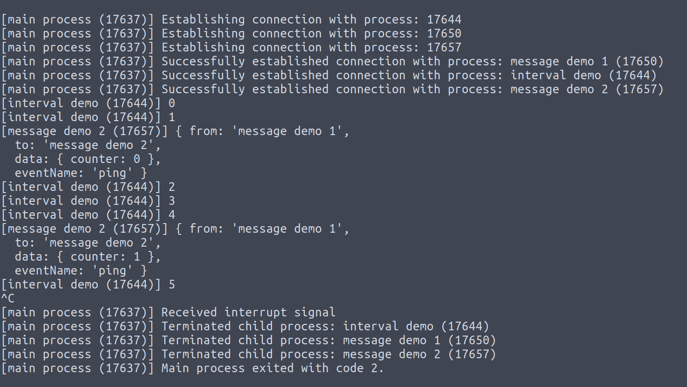

# intermediate-process-event-buss

The IPEB or Intermediate Process Event Buss is an npm package that aims to trivialize inter-process communications between NODE processes.

```js
// index.js
const { ProcessHub } = require('ipeb');
const path = require('path');

const hub = new ProcessHub(process);
processHub.spawn(path.join(__dirname, 'intervalDemo.js'));
processHub.spawn(path.join(__dirname, 'messageDemo1.js'));
processHub.spawn(path.join(__dirname, 'messageDemo2.js'));
```

```js
// intervalDemo
const { ProcessClient } = require('ipeb');
const processClient = new ProcessClient('interval demo');

let i = 0;
setInterval(() => console.log(i++), 1000);
```

```js
// messageDemo1.js
const { ProcessClient } = require('ipdb');

const client = new ProcessClient('message demo 1');

let i = 0;
setInterval(() => client.emit('ping', {
  counter: i++,
}), 3000);
```

```js
// messageDemo2.js
const { ProcessClient } = require('ipeb');

const processClient = new ProcessClient('message demo 2');

processClient.on('ping', (message) => {
  console.log(message.counter);
});
```


